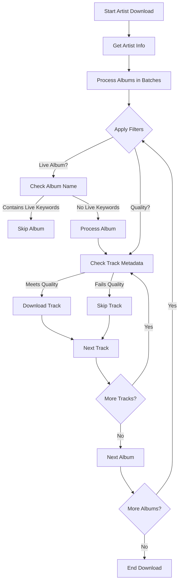
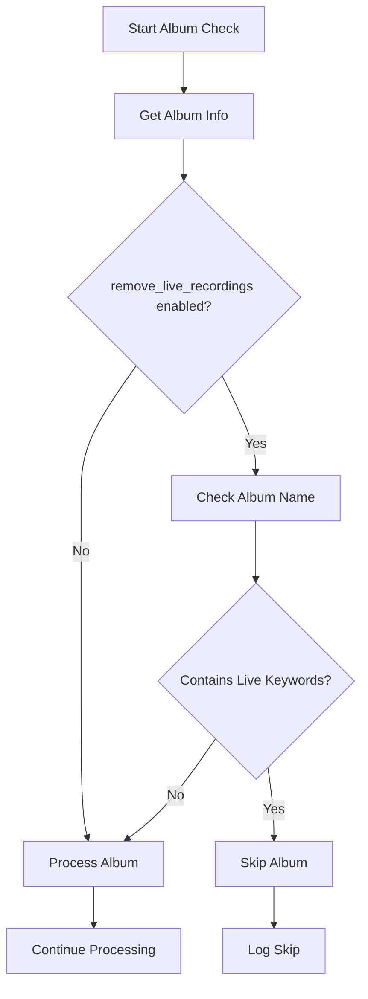
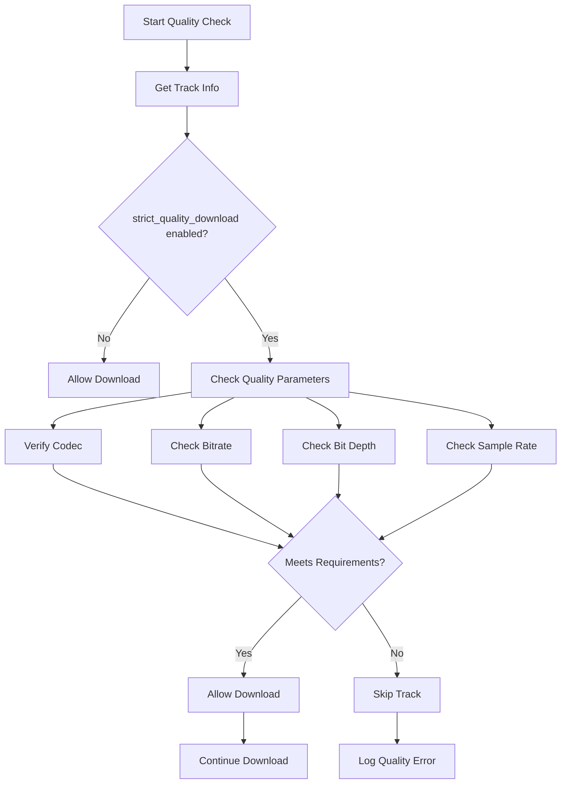
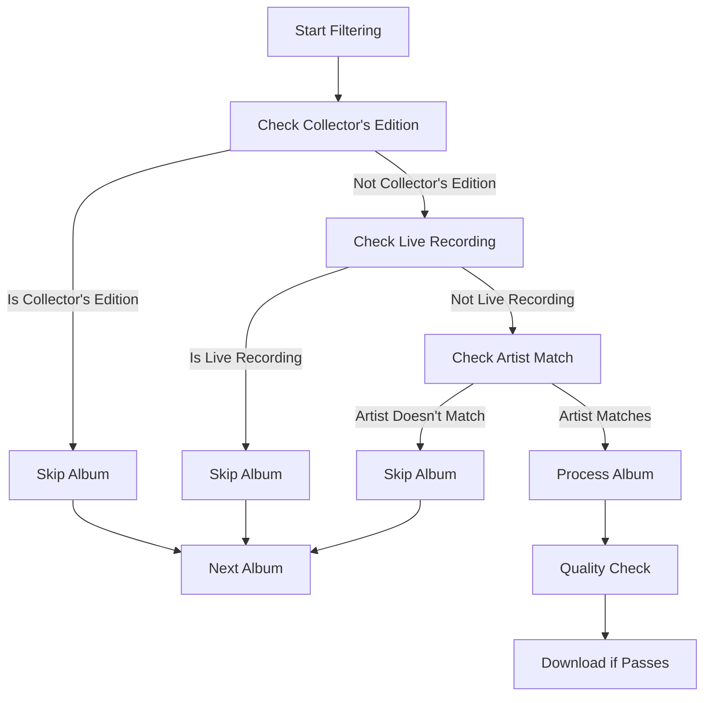
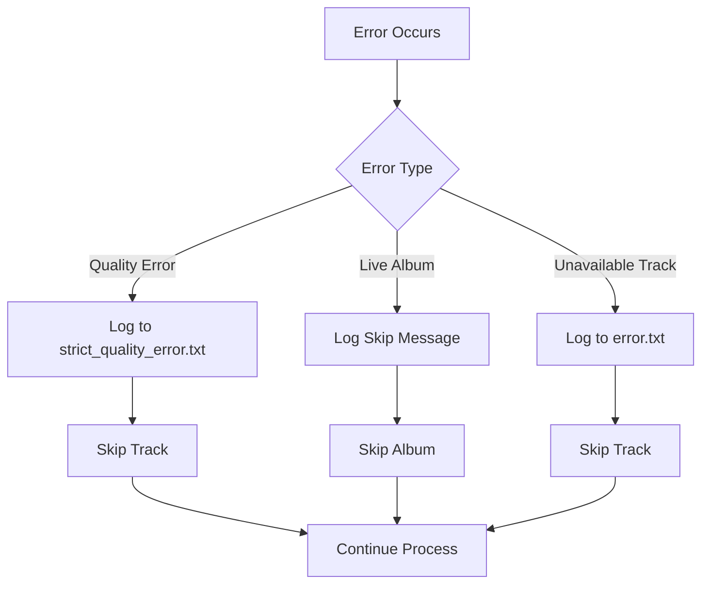

# Artist Download Process Analysis

## Background Processes with Strict Settings Enabled

### 1. Artist Matching Process (`strict_artist_match = true`)
When downloading an artist with `strict_artist_match` enabled, the following checks are performed:

1. **Initial Artist Verification**
   - The system verifies that the artist ID matches exactly with the requested artist
   - All tracks and albums are filtered to ensure they belong to the exact artist ID
   - Collaborations and featured appearances are filtered out unless they are the main artist

2. **Album Filtering**
   - Only albums where the artist is the primary artist are included
   - Compilations and various artist albums are excluded
   - Albums where the artist is only featured or credited are filtered out

### 2. Quality Control Process (`strict_quality_download = true`)
When `strict_quality_download` is enabled, the following quality checks are performed:

1. **Audio Quality Verification**
   - Verifies that the downloaded audio matches the requested quality settings
   - For FLAC files (as seen in the test):
     - Bitrate: 1411kbps
     - Bit depth: 16bit
     - Sample rate: 44.1kHz
   - Rejects downloads that don't meet these specifications

2. **Download Process**
   - Downloads are performed in batches for better performance
   - Each track is verified for quality before being saved
   - Failed quality checks result in download retries or rejection

### 3. Additional Processes

1. **Metadata Handling**
   - Downloads and embeds album artwork
   - Retrieves and embeds lyrics
   - Retrieves and embeds credits
   - Tags files with proper metadata

2. **File Organization**
   - Creates appropriate directory structure
   - Names files according to configured format
   - Handles special characters in filenames

3. **Progress Tracking**
   - Shows download progress for each track
   - Displays batch processing information
   - Provides detailed status updates

### 4. Error Handling

1. **Quality Mismatch**
   - If a track doesn't meet quality requirements, it's logged
   - System attempts to find alternative sources if available
   - Failed downloads are reported

2. **Artist Match Issues**
   - Tracks not matching the strict artist criteria are logged
   - System provides feedback about filtered content
   - Maintains integrity of artist-specific downloads

## Configuration Impact

The strict settings significantly impact the download process by:
1. Ensuring higher quality downloads
2. Maintaining artist-specific content purity
3. Reducing the chance of downloading incorrect or low-quality content
4. Providing more detailed logging and feedback

## Performance Considerations

1. **Download Speed**
   - Strict quality checks may slightly impact download speed
   - Batch processing helps maintain efficiency
   - Progress bars show real-time download status

2. **Resource Usage**
   - Additional verification steps require more processing
   - Memory usage is optimized through batch processing
   - Disk space is used efficiently through proper file organization

## Filter Options Analysis

### 1. Artist Download Filters
When downloading an artist, the following filter options are enabled by default:

1. **Album Type Filters**
   - `remove_collectors_editions`: True
     - Excludes collector's edition albums
     - Filters out special editions and deluxe versions
     - Focuses on standard album releases

   - `remove_live_recordings`: True
     - Excludes live albums and concert recordings
     - Filters out live performances and bootlegs
     - Focuses on studio recordings only

2. **Artist Credit Filters**
   - `return_credited_albums`: True
     - Includes albums where the artist is credited
     - Considers both primary and featured roles
     - Maintains comprehensive artist discography

   - `separate_tracks_skip_downloaded`: True
     - Skips already downloaded tracks
     - Prevents duplicate downloads
     - Optimizes download process

3. **Quality Filters**
   - `strict_quality_download`: True
     - Enforces quality standards for all downloads
     - Verifies audio specifications
   - Rejects substandard quality files

4. **Artist Matching Filters**
   - `strict_artist_match`: True
     - Ensures exact artist matching
     - Filters out similar artist names
     - Prevents incorrect artist downloads

   - `ignore_different_artists`: True
     - Skips tracks with different artist names
     - Prevents cross-artist contamination
     - Maintains artist-specific collections

### 2. Filter Implementation Process

1. **Pre-Download Filtering**
   - Filters are applied before download starts
   - Album list is filtered based on criteria
   - Track list is filtered within each album

2. **During Download Filtering**
   - Quality checks during download
   - Artist verification for each track
   - Metadata validation

3. **Post-Download Filtering**
   - Final quality verification
   - File organization based on filters
   - Duplicate checking

### 3. Filter Impact on Download

1. **Content Selection**
   - More focused artist collection
   - Higher quality content
   - Reduced duplicate content

2. **Download Efficiency**
   - Faster downloads by skipping duplicates
   - Reduced bandwidth usage
   - Optimized storage usage

3. **Content Organization**
   - Cleaner file structure
   - Better metadata organization
   - Consistent quality standards

### 4. Filter Configuration

These filters can be configured in the settings.json file:
```json
{
    "artist_downloading": {
        "return_credited_albums": true,
        "separate_tracks_skip_downloaded": true
    },
    "advanced": {
        "ignore_different_artists": true,
        "remove_collectors_editions": true,
        "remove_live_recordings": true,
        "strict_artist_match": true
    }
}
```

The combination of these filters ensures:
1. High-quality downloads
2. Accurate artist matching
3. Efficient download process
4. Clean content organization

## Quality Checking Process

### 1. Quality Verification Method
The quality checking process is performed through the `_check_strict_quality_requirement` method, which verifies the following parameters:

1. **Codec Verification**
   - Checks the audio codec type (FLAC, MP3, AAC, etc.)
   - Verifies against allowed codecs for the requested quality level
   - Example from test output: `Codec: FLAC, bitrate: 1411kbps, bit depth: 16bit, sample rate: 44.1kHz`

2. **Quality Level Requirements**
   When `strict_quality_download` is enabled, the following quality requirements are enforced:

   | Quality Setting | Allowed Codecs | Additional Requirements |
   |----------------|----------------|------------------------|
   | **hifi** | FLAC | >16bit OR >44.1kHz sample rate |
   | **lossless** | FLAC, ALAC, WAV | Any bit depth/sample rate |
   | **high** | MP3, AAC, HE-AAC, Vorbis, Opus | ≥256kbps bitrate |
   | **medium** | MP3, AAC, HE-AAC, Vorbis, Opus | 128-255kbps bitrate |
   | **low** | MP3, AAC, HE-AAC, Vorbis, Opus | <128kbps bitrate |

### 2. Quality Check Implementation

1. **Pre-Download Check**
   ```python
   quality_tier = QualityEnum[self.global_settings['general']['download_quality'].upper()]
   codec_options = CodecOptions(
       spatial_codecs = self.global_settings['codecs']['spatial_codecs'],
       proprietary_codecs = self.global_settings['codecs']['proprietary_codecs'],
   )
   track_info: TrackInfo = self.service.get_track_info(track_id, quality_tier, codec_options, **extra_kwargs)
   ```

2. **Quality Verification**
   - Checks if the track meets the requested quality standards
   - Verifies codec, bitrate, bit depth, and sample rate
   - Logs any quality mismatches to `strict_quality_error.txt`

3. **Error Handling**
   - If quality requirements are not met:
     - Logs the error with detailed information
     - Skips the track download
     - Continues with the next track

### 3. Quality Check Output

1. **Success Case**
   ```
   === Downloading track Track Name (123456) ===
   Album: Album Name (789)
   Codec: FLAC, bitrate: 1411kbps, bit depth: 16bit, sample rate: 44.1kHz
   === Track 123456 downloaded ===
   ```

2. **Failure Case**
   ```
   Strict quality download failed: Requested quality "lossless" unavailable for: 
   Artist [123]/Album [456]/Track [789] 
   (codec: MP3, bitrate: 320, bit_depth: 16, sample_rate: 44.1)
   === Track 789 failed due to strict quality requirements ===
   ```

### 4. Quality Check Benefits

1. **Consistency**
   - Ensures all downloaded tracks meet quality standards
   - Maintains consistent audio quality across collection
   - Prevents downloading of substandard quality tracks

2. **Efficiency**
   - Checks quality before downloading
   - Avoids downloading tracks that don't meet requirements
   - Saves bandwidth and storage space

3. **Transparency**
   - Provides detailed quality information
   - Logs all quality-related issues
   - Makes it easy to track quality problems

## Live Album Filtering Process

### 1. Filter Implementation
The live album filtering is implemented through keyword matching in the album name, not through API metadata. Here's how it works:

1. **Keyword-Based Filtering**
   ```python
   live_keywords = ['live', 'concert', 'performance', 'stage', 'tour', 'acoustic', 'unplugged', 'mtv', 'bbc', 'radio', 'session']
   if any(keyword in album_info.name.lower() for keyword in live_keywords):
       self.print(f'Skipping live recording: {album_info.name}', drop_level=2)
       should_skip = True
   ```

2. **Filter Application**
   - Applied during the artist download process
   - Checks album names against predefined keywords
   - Case-insensitive matching
   - Applied before downloading any tracks

### 2. Filter Process Flow

1. **Pre-Download Check**
   - Album info is retrieved from the service
   - Album name is checked against live keywords
   - Decision is made before any download starts

2. **Filter Application Order**
   ```python
   # First check collector's editions
   if self.global_settings['advanced'].get('remove_collectors_editions', False):
       collectors_keywords = ['collector', 'deluxe', 'expanded', 'bonus', 'special', 'anniversary', 'remastered', 'reissue', 'limited']
       if any(keyword in album_info.name.lower() for keyword in collectors_keywords):
           should_skip = True
   
   # Then check live recordings
   if not should_skip and self.global_settings['advanced'].get('remove_live_recordings', False):
       live_keywords = ['live', 'concert', 'performance', 'stage', 'tour', 'acoustic', 'unplugged', 'mtv', 'bbc', 'radio', 'session']
       if any(keyword in album_info.name.lower() for keyword in live_keywords):
           should_skip = True
   ```

### 3. Filter Keywords

1. **Live Recording Keywords**
   - 'live'
   - 'concert'
   - 'performance'
   - 'stage'
   - 'tour'
   - 'acoustic'
   - 'unplugged'
   - 'mtv'
   - 'bbc'
   - 'radio'
   - 'session'

2. **Filter Behavior**
   - Matches any of these keywords in the album name
   - Case-insensitive matching
   - Partial word matching (e.g., "live" will match "liveshow")

### 4. Filter Output

1. **Success Case**
   ```
   Album 1: Studio Album Name
   === Downloading album Studio Album Name (123456) ===
   ```

2. **Filtered Case**
   ```
   Skipping live recording: Album Name (Live)
   ```

### 5. Key Differences from Quality Checking

1. **Implementation Method**
   - Live filtering: Keyword-based text matching
   - Quality checking: API metadata verification

2. **Check Timing**
   - Live filtering: Pre-download, based on album name
   - Quality checking: Pre-download, based on track metadata

3. **Data Source**
   - Live filtering: Album name string
   - Quality checking: Track metadata from API

4. **Accuracy**
   - Live filtering: May have false positives/negatives due to keyword matching
   - Quality checking: Precise based on actual track metadata 

## Workflow Diagrams

### 1. Overall Download Process


### 2. Live Album Filtering Process


### 3. Quality Checking Process


### 4. Filter Application Order


### 5. Error Handling Flow


These diagrams show:
1. The overall download process and how filters interact
2. The specific live album filtering workflow
3. The detailed quality checking process
4. The order in which filters are applied
5. How different types of errors are handled

The workflows demonstrate that:
- Live album filtering is a simple text-based check
- Quality checking is a more complex metadata verification
- Both processes happen before download starts
- Error handling is specific to each type of check 

## API Usage and Remote Reset Analysis

### API Calls That Can Cause Remote Reset

1. **Artist Information Retrieval**
   - `get_artist_info()` - Fetches basic artist metadata
   - `get_artist_name()` - Gets artist name through session
   - `get_artist_album_ids()` - Retrieves album IDs in batches
   - These calls can trigger rate limits or connection resets if too many requests are made

2. **Album Information Retrieval**
   - `get_album_info()` - Fetches detailed album metadata
   - Called for each album in the artist's catalog
   - High frequency of calls can lead to remote resets

3. **Track Information Retrieval**
   - `get_track_info()` - Gets detailed track metadata
   - `get_track_download()` - Retrieves download URLs
   - Most likely to cause remote resets due to high volume

4. **Quality Verification**
   - Uses API metadata for quality checks
   - Each track requires an API call to verify quality parameters
   - Can trigger rate limits if many tracks are checked simultaneously

### Non-API Processes (Safe from Remote Reset)

1. **Live Album Filtering**
   - Uses local text matching
   - No API calls involved
   - Keywords: 'live', 'concert', 'performance', etc.
   - Safe from remote resets

2. **File Organization**
   - Local file system operations
   - No network calls
   - Safe from remote resets

3. **Tagging and Metadata**
   - Uses already downloaded information
   - No additional API calls
   - Safe from remote resets

### Error Handling for Remote Resets

1. **Batch Processing**
   - Albums are processed in batches of 50
   - Helps prevent overwhelming the API
   - Reduces chance of remote resets

2. **Error Recovery**
   - Failed tracks are logged
   - Process continues with next track
   - No automatic retry mechanism

3. **Quality Check Failures**
   - Logged to `strict_quality_error.txt`
   - Track is skipped
   - Process continues

### Recommendations to Avoid Remote Resets

1. **Rate Limiting**
   - Implement delays between API calls
   - Use batch processing (already implemented)
   - Consider implementing exponential backoff

2. **Error Handling**
   - Add retry mechanism for failed API calls
   - Implement proper error logging
   - Add recovery options for interrupted downloads

3. **Quality Checking**
   - Consider caching quality information
   - Batch quality checks where possible
   - Implement local quality verification where possible 