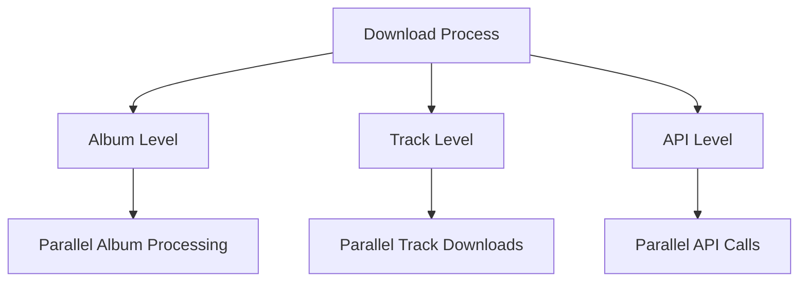

# Concurrent Download Analysis

## Current State
The current codebase (`OrpheusDL-Modded`) does not support concurrent downloads. It processes:
- Albums sequentially
- Tracks sequentially within albums
- API calls one at a time

## Theoretical Concurrent Implementation

### 1. Possible Concurrency Levels



### 2. Implementation Approaches

#### A. Album-Level Concurrency
```python
# Theoretical implementation
def download_artist_concurrent(artist_id):
    albums = get_artist_albums(artist_id)
    with ThreadPoolExecutor(max_workers=3) as executor:
        futures = [executor.submit(process_album, album) for album in albums]
        for future in as_completed(futures):
            handle_album_result(future.result())
```

#### B. Track-Level Concurrency
```python
# Theoretical implementation
def process_album_concurrent(album_id):
    tracks = get_album_tracks(album_id)
    with ThreadPoolExecutor(max_workers=5) as executor:
        futures = [executor.submit(download_track, track) for track in tracks]
        for future in as_completed(futures):
            handle_track_result(future.result())
```

#### C. API Call Concurrency
```python
# Theoretical implementation
def get_track_info_concurrent(track_ids):
    with ThreadPoolExecutor(max_workers=10) as executor:
        futures = [executor.submit(get_track_info, track_id) for track_id in track_ids]
        return [future.result() for future in as_completed(futures)]
```

### 3. Benefits of Concurrent Implementation

1. **Performance Improvements**
   - Faster overall download time
   - Better resource utilization
   - Reduced idle time
   - Higher throughput

2. **Resource Efficiency**
   - Better CPU utilization
   - Improved network usage
   - Reduced waiting time
   - More efficient API usage

3. **User Experience**
   - Faster downloads
   - Better progress tracking
   - More responsive interface
   - Better error handling

### 4. Implementation Challenges

1. **API Rate Limiting**
   - Need to implement rate limiting
   - Must handle API quotas
   - Need to manage concurrent requests
   - Must handle API errors

2. **Resource Management**
   - Memory usage control
   - CPU usage management
   - Network bandwidth control
   - Disk I/O management

3. **Error Handling**
   - Concurrent error handling
   - Race condition prevention
   - Deadlock prevention
   - Resource cleanup

4. **State Management**
   - Progress tracking
   - Error state handling
   - Resource state management
   - Download state tracking

### 5. Required Modifications

1. **Core Changes**
   - Add threading/multiprocessing support
   - Implement concurrent download logic
   - Add resource management
   - Implement rate limiting

2. **API Layer**
   - Add concurrent API calls
   - Implement request queuing
   - Add rate limiting
   - Handle concurrent errors

3. **Download Layer**
   - Implement concurrent downloads
   - Add download queuing
   - Handle concurrent file operations
   - Manage download states

4. **UI Layer**
   - Update progress tracking
   - Add concurrent status display
   - Improve error reporting
   - Add resource usage display

### 6. Implementation Recommendations

1. **Architecture Changes**
   - Add thread pool management
   - Implement work queues
   - Add resource pools
   - Implement state management

2. **Error Handling**
   - Add concurrent error handling
   - Implement retry mechanisms
   - Add error recovery
   - Improve error logging

3. **Resource Management**
   - Implement resource limits
   - Add resource monitoring
   - Implement cleanup
   - Add resource allocation

4. **Performance Optimization**
   - Add caching
   - Implement request batching
   - Add connection pooling
   - Optimize resource usage

### 7. Potential Issues

1. **Technical Challenges**
   - Race conditions
   - Deadlocks
   - Resource contention
   - Memory leaks

2. **API Limitations**
   - Rate limiting
   - Connection limits
   - Request quotas
   - API restrictions

3. **System Resources**
   - Memory usage
   - CPU usage
   - Disk I/O
   - Network bandwidth

4. **Error Handling**
   - Concurrent errors
   - State management
   - Resource cleanup
   - Error recovery

### 8. Implementation Strategy

1. **Phase 1: Basic Concurrency**
   - Add thread pool
   - Implement basic concurrent downloads
   - Add basic error handling
   - Implement basic rate limiting

2. **Phase 2: Resource Management**
   - Add resource limits
   - Implement monitoring
   - Add cleanup
   - Improve error handling

3. **Phase 3: Optimization**
   - Add caching
   - Implement batching
   - Add connection pooling
   - Optimize performance

4. **Phase 4: UI Updates**
   - Update progress display
   - Add resource monitoring
   - Improve error reporting
   - Add performance metrics 