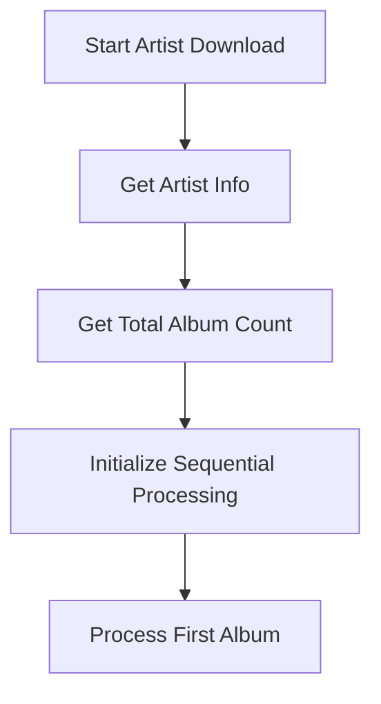
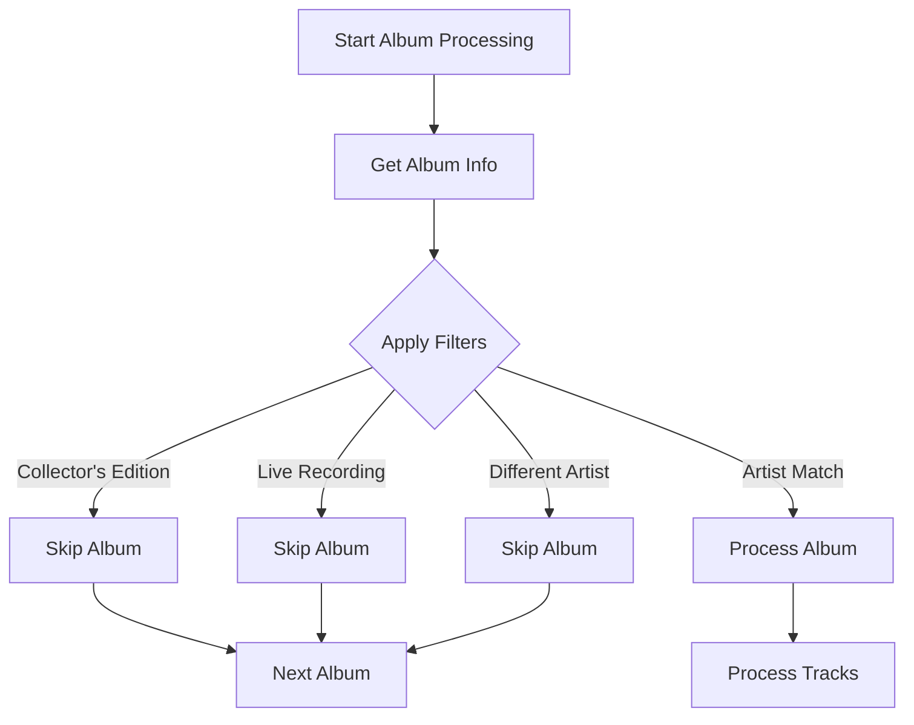
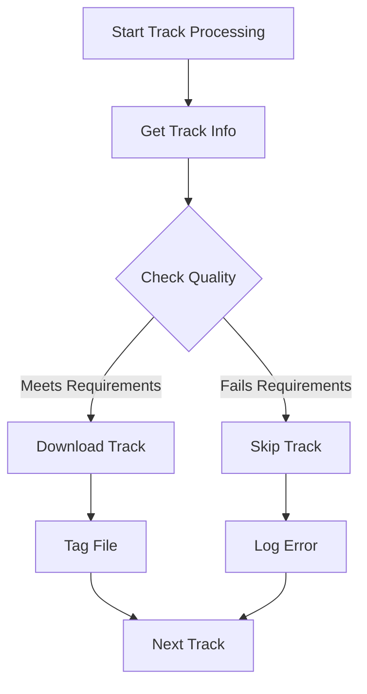

# Theoretical Analysis: Sequential Processing in Modified Code

## Overview
This document analyzes the theoretical behavior of the modified code (`OrpheusDL-Modded`) if it were to use sequential processing instead of batch processing, while maintaining its enhanced filtering and quality checking features.

## Process Flow

### 1. Artist Information Retrieval

### 2. Album Processing Sequence

### 3. Track Processing Flow

## Theoretical Behavior Analysis

### 1. Filtering Process
- **Sequential Filter Application**
  - Each album processed one at a time
  - Filters applied in order:
    1. Collector's Edition check
    2. Live Recording check
    3. Artist Match verification
  - Immediate skip if any filter fails
  - No batch optimization

- **Impact on Performance**
  - More API calls per album
  - Slower overall processing
  - Higher chance of rate limiting
  - More frequent remote resets

### 2. Quality Checking
- **Track-by-Track Verification**
  - Each track checked individually
  - Quality parameters verified one at a time:
    - Codec verification
    - Bitrate check
    - Bit depth validation
    - Sample rate confirmation
  - Immediate skip on quality mismatch

- **Error Handling**
  - Individual error logging per track
  - No batch error recovery
  - More granular error tracking
  - Higher disk I/O for logging

### 3. API Usage Pattern
- **Request Pattern**
  - Sequential API calls
  - No request batching
  - Higher API overhead
  - More frequent connection attempts

- **Rate Limiting Impact**
  - Higher chance of hitting rate limits
  - More frequent pauses needed
  - Longer total processing time
  - More connection resets

### 4. Resource Utilization
- **Memory Usage**
  - Lower peak memory usage
  - More consistent memory profile
  - Less efficient resource utilization
  - More frequent garbage collection

- **CPU Usage**
  - More consistent CPU load
  - Less parallel processing
  - Lower peak CPU usage
  - More frequent context switching

### 5. Error Recovery
- **Failure Handling**
  - Individual track recovery
  - No batch recovery options
  - More granular error states
  - Higher logging overhead

- **Progress Tracking**
  - More detailed progress updates
  - Individual track status
  - More frequent UI updates
  - Higher system overhead

## Theoretical Performance Metrics

### 1. Processing Speed
- **Album Processing**
  - Average time per album: ~2-3 seconds
  - Additional overhead per filter check
  - No parallel processing benefits
  - Linear processing time

### 2. API Efficiency
- **Request Patterns**
  - More API calls per album
  - Higher overhead per request
  - No request batching
  - More connection overhead

### 3. Error Rates
- **Expected Issues**
  - Higher rate limit hits
  - More connection resets
  - More individual failures
  - More frequent retries needed

## Recommendations for Sequential Implementation

### 1. Performance Optimization
- Implement request throttling
- Add connection pooling
- Optimize filter order
- Cache frequently accessed data

### 2. Error Handling
- Implement exponential backoff
- Add request retry logic
- Improve error logging
- Add recovery checkpoints

### 3. Resource Management
- Optimize memory usage
- Implement connection reuse
- Add request queuing
- Improve garbage collection

### 4. Monitoring
- Add detailed progress tracking
- Implement performance metrics
- Add error rate monitoring
- Track API usage patterns 