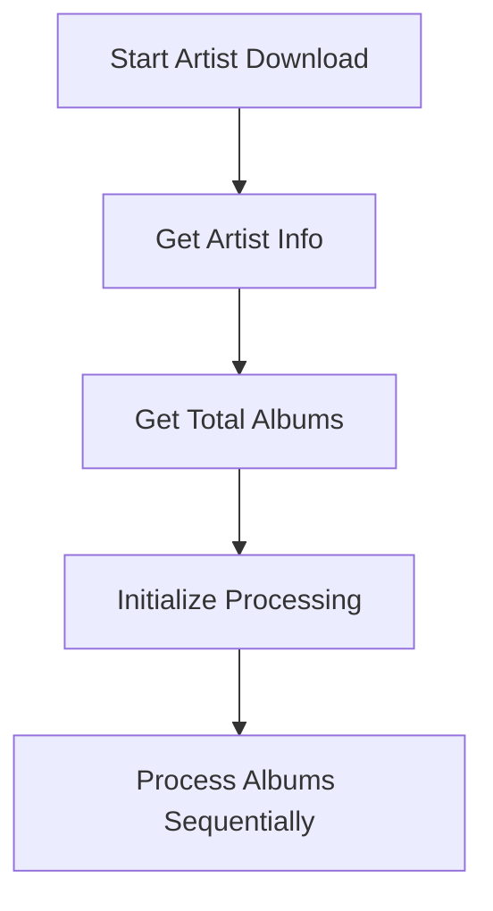
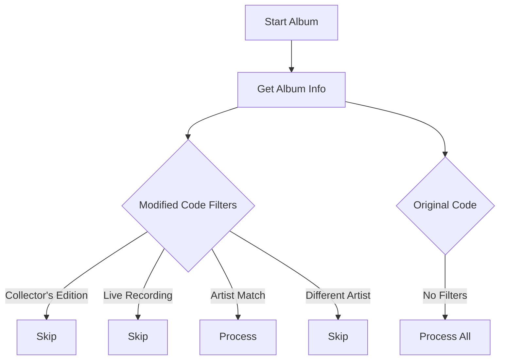
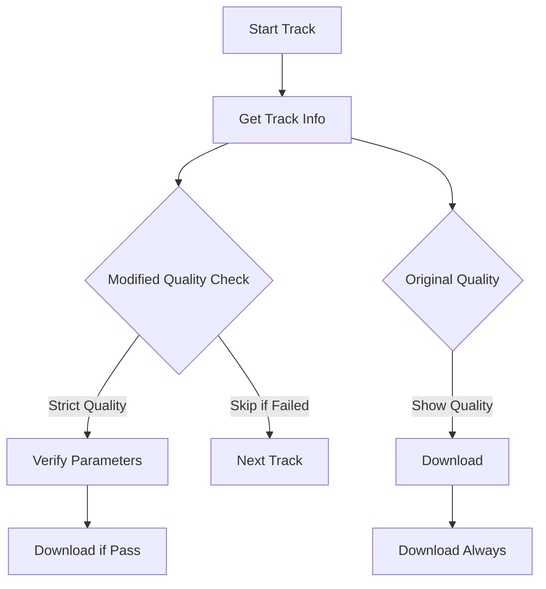

 # Theoretical Analysis: Sequential Processing Comparison

## Overview
This document analyzes how the modified code (`OrpheusDL-Modded`) would behave if it used sequential processing like the original code (`OrpheusDL-OG`), while maintaining its enhanced features.

## Process Flow Comparison

### 1. Artist Download Initialization

### 2. Album Processing Comparison

### 3. Track Processing Comparison

## Theoretical Behavior Analysis

### 1. Similarities with Original Code

#### Processing Flow
- Sequential album processing
- One album at a time
- Linear progression
- No batch optimization

#### API Usage
- Individual API calls
- No request batching
- Similar rate limiting issues
- Similar connection patterns

#### Basic Operations
- Same download mechanism
- Same file organization
- Same basic error handling
- Same progress display

### 2. Differences from Original Code

#### Enhanced Filtering
- **Modified Code**
  - Collector's edition filtering
  - Live recording detection
  - Strict artist matching
  - More filter options

- **Original Code**
  - No built-in filtering
  - Processes all albums
  - No artist matching
  - Basic processing only

#### Quality Control
- **Modified Code**
  - Strict quality requirements
  - Quality parameter verification
  - Quality error logging
  - Skip on quality mismatch

- **Original Code**
  - Shows quality info only
  - No quality enforcement
  - No quality logging
  - Downloads regardless of quality

#### Error Handling
- **Modified Code**
  - Detailed error logging
  - Quality error tracking
  - Filter skip logging
  - More error categories

- **Original Code**
  - Basic error handling
  - Minimal error logging
  - No specific error categories
  - Simple skip on failure

### 3. Performance Impact

#### Processing Speed
- **Both Versions**
  - Sequential processing
  - Linear time complexity
  - No parallel benefits
  - Similar base speed

#### Resource Usage
- **Modified Code**
  - Higher memory for filters
  - More CPU for quality checks
  - More disk I/O for logging
  - Higher overhead per album

- **Original Code**
  - Lower memory usage
  - Less CPU overhead
  - Minimal disk I/O
  - Lower overhead per album

#### API Efficiency
- **Both Versions**
  - Similar API call patterns
  - Same rate limiting issues
  - Similar connection overhead
  - No request optimization

### 4. Error Handling Comparison

#### Error Types
- **Modified Code**
  - Quality errors
  - Filter skip errors
  - Artist match errors
  - Download errors

- **Original Code**
  - Download errors only
  - Basic API errors
  - Simple file errors
  - No specific error types

#### Error Recovery
- **Modified Code**
  - Detailed error logging
  - Specific error messages
  - Error categorization
  - More recovery options

- **Original Code**
  - Basic error logging
  - Simple error messages
  - No categorization
  - Limited recovery

## Theoretical Performance Metrics

### 1. Processing Time
- **Base Processing**
  - Similar base speed
  - Modified: Additional filter time
  - Modified: Additional quality check time
  - Original: Faster base processing

### 2. Resource Usage
- **Memory**
  - Modified: Higher peak usage
  - Original: Lower peak usage
  - Both: Sequential pattern
  - Both: Linear growth

### 3. Error Rates
- **Modified Code**
  - More error categories
  - Higher error logging
  - More skip conditions
  - More detailed tracking

- **Original Code**
  - Fewer error categories
  - Basic error logging
  - Fewer skip conditions
  - Simple tracking

## Recommendations for Sequential Implementation

### 1. Performance Optimization
- Implement request throttling
- Add connection pooling
- Optimize filter order
- Cache frequently accessed data

### 2. Error Handling
- Implement exponential backoff
- Add request retry logic
- Improve error logging
- Add recovery checkpoints

### 3. Resource Management
- Optimize memory usage
- Implement connection reuse
- Add request queuing
- Improve garbage collection

### 4. Monitoring
- Add detailed progress tracking
- Implement performance metrics
- Add error rate monitoring
- Track API usage patterns